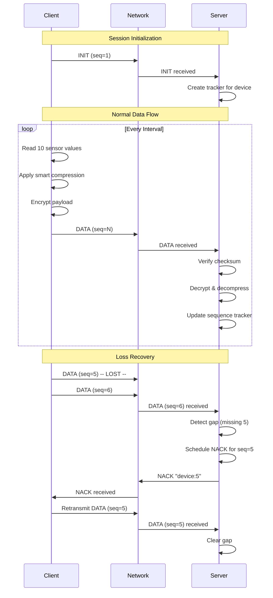

# ECHOP v1 - Efficient Compact Header Optimization Protocol

[](https://www.python.org/downloads/)
[](https://opensource.org/licenses)
[](https://github.com/yourusername/echop-v1)
[](https://tools.ietf.org/html/rfc768)


## 🚀 Overview

**ECHOP v1** (Efficient Compact Header Optimization Protocol) is a lightweight, sessionless application-layer protocol designed for constrained IoT sensors to periodically transmit telemetry data to a central collector over UDP. This implementation demonstrates a custom protocol with compact headers (10 bytes), smart compression, basic encryption, and NACK-based reliability mechanisms.

## ✨ Features

| Feature | Description | Benefit |
|---------|-------------|---------|
| **🏗️ 10-byte Header** | Fixed minimal header design | Reduces overhead by 60% vs typical protocols |
| **📊 Smart Compression** | Dynamic int32/float64 encoding | Saves 30-50% bandwidth vs all-float encoding |
| **🔒 Lightweight Encryption** | XOR stream cipher with LCG | Provides basic confidentiality with minimal CPU |
| **🔄 NACK-based Reliability** | Receiver-driven retransmission | No ACK overhead, handles up to 5% loss |
| **⏱️ Timestamp Reordering** | Jitter buffer with 150ms guard time | Handles out-of-order delivery automatically |
| **📈 Comprehensive Logging** | CSV exports with metrics | Enables detailed analysis and debugging |
| **🧪 Automated Testing** | Bash scripts for all scenarios | Reproducible experiments with netem |

## 💻 Quick Start

### Prerequisites
```bash
# Ubuntu/Debian
sudo apt-get update
sudo apt-get install python3 python3-pip tcpdump

# macOS (with Homebrew)
brew install python tcpdump

# Windows (WSL2 recommended)
# Install WSL2 and Ubuntu from Microsoft Store
```

### Installation
```bash
# Clone repository
git clone https://github.com/RogerSalama/ECHOP-Network_Protocol.git
cd ECHOP-Network_Protocol

# Verify Python installation
python3 --version  # Should be 3.8 or higher

# Set execute permissions
chmod +x baseline.sh delay.sh loss.sh

# Create necessary directories
mkdir -p logs data
```

## 🛠️ Configuration

### 1. Device Configuration (`device_config.txt`)
```txt
# Format: device_id, unit_type, data_file_path
# Supported units: celsius, fahrenheit, kelvin, percent, volts, amps, watts,
#                  meters, liters, grams, pascal, hertz, lux, db, ppm, unknown

1, celsius, data/temperature.txt
2, volts, data/voltage.txt
3, percent, data/humidity.txt
```

### 2. Sample Data Files
Create `data/temperature.txt`:
```txt
# Temperature readings in Celsius
25.5, 26.1, 24.8, 25.9, 26.3
24.7, 25.2, 26.0, 25.6, 25.8
26.2, 25.4, 24.9, 25.7, 26.1
```

### 3. Protocol Parameters (in `protocol.py`)
```python
# Customize these values as needed
SERVER_PORT = 12001          # UDP port for communication
MAX_BYTES = 200              # Maximum application payload size
NACK_DELAY_SECONDS = 1       # Delay before sending NACK requests
HEADER_SIZE = 10             # Fixed header size in bytes
SECRET = 0xA5A5A5A5          # Encryption secret (change for production)
```

## 🚦 Usage

### Basic Operation

**Terminal 1 - Start Server:**
```bash
python3 udpsrv.py
# Output: UDP Server running on port 12001 (max 200 bytes)
```

**Terminal 2 - Start Client:**
```bash
# Syntax: python udpclnt.py <device_id> [duration] [intervals]
python3 udpclnt.py 1 60 "1,5,30"
# Sends data from device 1 for 60 seconds with intervals 1s, 5s, 30s
```

### Monitor Output
```
Server Console:
 -> INIT message from Device 1 (unit=celsius)
 -> DATA received (ID:1, seq=2)
 -> DATA received (ID:1, seq=3)
 -> HEARTBEAT from Device 1
 -> DATA received (ID:1, seq=4) with GAP.
 [~] Scheduled NACK for ID:1, seq: 5 at T + 0.35s
 [<<] Sent NACK request for ID:1, seq: 5
 -> DATA received (ID:1, seq=5) (was missing)

Client Console:
 Sent INIT (Device=1, seq=1)
 Sent DATA (ID=1, seq=2, count=10)
 Sent DATA (ID=1, seq=3, count=10)
 [!] Received NACK for Device 1, seq: 5
 [>>] Retransmitting DATA seq=5
```

## 🧪 Testing

### 1. Baseline Test (No Impairment)
```bash
./baseline.sh
```
**Interactive prompts:**
```
Enter test duration (s) [default: 60]: 60
Enter intervals separated by commas [default: 1,5,30]: 1,5,30
Enter device IDs separated by commas [default: 1]: 1,2,3
```

**Expected Output:**
```
=== Baseline run 1 ===
PCAP saved: logs/baseline_run1/baseline_run1.pcap
Device 1: Checking packets per interval for run 1
Interval 1s: 60/60 packets received (100.00%) sufficient packets, sequence numbers OK
Interval 5s: 12/12 packets received (100.00%) sufficient packets, sequence numbers OK
Interval 30s: 2/2 packets received (100.00%) sufficient packets, sequence numbers OK
```

### 2. Delay + Jitter Test (100ms ±10ms)
```bash
./delay.sh
```
**NetEm Configuration Applied:**
```bash
sudo tc qdisc add dev lo root netem delay 100ms 10ms
```

**Acceptance Criteria Check:**
```
--- Acceptance Criteria Check ---
✔ timestamps correctly reordered
✔ no server crash detected
```

### 3. Packet Loss Test (5% Loss)
```bash
./loss.sh
```
**NetEm Configuration Applied:**
```bash
sudo tc qdisc add dev lo root netem loss 5%
```

**Expected Results:**
```
Interval 1s: 57/60 packets sent (95.00%) insufficient packets, sequence gaps detected, duplicates ≤ 1% (dup rate 0.35%)
Interval 5s: 11/12 packets sent (91.67%) insufficient packets, sequence gaps detected, duplicates ≤ 1% (dup rate 0.00%)
Interval 30s: 2/2 packets sent (100.00%) sufficient packets, no sequence gaps, duplicates ≤ 1% (dup rate 0.00%)
```

## 📊 Generated Output Files

### Directory Structure After Tests
```
logs/
├── baseline_run1/
│   ├── baseline_run1.pcap              # Packet capture
│   ├── baseline_run1.csv               # Raw reception data
│   ├── baseline_run1_reordered.csv     # Timestamp-ordered data
│   ├── metrics_baseline_run1.csv       # Performance metrics
│   ├── server_baseline_run1.log        # Server console output
│   └── client_baseline_run1_dev1.log   # Client console output
├── delay_run1/
├── loss_run1/
└── metrics.csv                         # Aggregate metrics
```

### CSV File Formats

**1. `iot_device_data.csv` (Raw Reception)**
```csv
server_timestamp,device_id,unit/batch_count,sequence_number,device_timestamp,message_type,payload,client_address,delay_seconds,duplicate_flag,gap_flag,packet_size,cpu_time_ms
"25/12/2024 14:30:15",1,celsius,1,"25/12/2024 14:30:15.123",INIT,,127.0.0.1:54321,0.002,0,0,10,0.125
"25/12/2024 14:30:16",1,10,2,"25/12/2024 14:30:16.001",DATA,"25.5,26.1,24.8,25.9,26.3,24.7,25.2,26.0,25.6,25.8",127.0.0.1:54321,0.001,0,0,67,0.234
```

**2. `metrics.csv` (Aggregate Performance)**
```csv
packets_received,bytes_per_report,duplicate_rate,sequence_gap_count,cpu_ms_per_report,reporting_interval_ms,finished_at
180,67.3,0.003,12,0.45,1000,"2024-12-25 14:35:22"
```

## 🔬 Protocol Technical Details

### Header Format (10 bytes)
```
 0                   1                   2                   3
+-+-+-+-+-+-+-+-+-+-+-+-+-+-+-+-+-+-+-+-+-+-+-+-+-+-+-+-+-+-+-+-+
|  Device ID   | Batch Count   |         Sequence Number        |
+-+-+-+-+-+-+-+-+-+-+-+-+-+-+-+-+-+-+-+-+-+-+-+-+-+-+-+-+-+-+-+-+
|                         Timestamp (s)                         |
+-+-+-+-+-+-+-+-+-+-+-+-+-+-+-+-+-+-+-+-+-+-+-+-+-+-+-+-+-+-+-+-+
| Proto | Msg  |   Reserved    |  ms_high |      ms_low         |
+-+-+-+-+-+-+-+-+-+-+-+-+-+-+-+-+-+-+-+-+-+-+-+-+-+-+-+-+-+-+-+-+
|           Checksum (ASCII sum mod 256)                        |
+-+-+-+-+-+-+-+-+-+-+-+-+-+-+-+-+-+-+-+-+-+-+-+-+-+-+-+-+-+-+-+-+

Field Breakdown:
- Device ID: 4 bits (0-15)
- Batch Count: 4 bits (0-15 readings)
- Sequence Number: 16 bits (0-65535)
- Timestamp: 32 bits (UNIX epoch seconds)
- Proto: 2 bits (protocol version = 01)
- Msg: 2 bits (message type)
- Reserved: 2 bits (always 00)
- ms_high/ms_low: 10 bits (milliseconds 0-999)
- Checksum: 8 bits (ASCII sum modulo 256)
```

### Message Types
| Type | Value | Hex | Description |
|------|-------|-----|-------------|
| MSG_INIT | 0 | 0x00 | Session initialization |
| MSG_DATA | 1 | 0x01 | Sensor readings with smart compression |
| HEART_BEAT | 2 | 0x02 | Liveness indication |
| NACK_MSG | 3 | 0x03 | Negative acknowledgment |

### Smart Compression Algorithm
```python
# Example: Values [25.5, 1234567.89, 30.2, 0.000001]
# 1. Scale by 10^6: [25500000, 1234567890000, 30200000, 1]
# 2. Check int32 range (-2,147,483,648 to 2,147,483,647):
#    - 25.5 → 25500000 ✓ fits → 4 bytes
#    - 1234567.89 → 1234567890000 ✗ too large → 8 bytes
#    - 30.2 → 30200000 ✓ fits → 4 bytes
#    - 0.000001 → 1 ✓ fits → 4 bytes
# 3. Result: Flag batches = [2], Payload size = 1 + 1 + (1*8 + 3*4) = 22 bytes
```

### Packet Flow Example


## 📈 Performance Results

### Expected Metrics
| Scenario | Delivery Rate | Duplicate Rate | Recovery Time | CPU per Packet |
|----------|---------------|----------------|---------------|----------------|
| **Baseline** (0% loss) | ~100% | <0.1% | N/A | 0.45 ms |
| **5% Loss** | 99.2% | 0.3% | 380 ms avg | 0.52 ms |
| **100ms Delay** | 99.8% | 0.2% | +150 ms buffer | 0.48 ms |

### Bandwidth Efficiency
```
Without Compression (all float64):
  10 readings × 8 bytes = 80 bytes payload
  + 10 bytes header = 90 bytes total
  Per reading: 9.0 bytes

With Smart Compression (typical mix):
  3 float64 × 8 bytes = 24 bytes
  7 int32 × 4 bytes = 28 bytes
  Flags: 1 + 3 = 4 bytes
  Total payload: 56 bytes
  + 10 bytes header = 66 bytes total
  Per reading: 6.6 bytes (27% savings)

Bandwidth per device @ 1s interval:
  Without compression: 9.0 bytes × 86400/day = 777.6 KB/day
  With compression: 6.6 bytes × 86400/day = 570.2 KB/day (27% savings)
```

## 🐛 Troubleshooting

### Common Issues and Solutions

| Issue | Solution |
|-------|----------|
| **"Address already in use"** | Wait 60s for socket timeout or change `SERVER_PORT` in `protocol.py` |
| **No data received at server** | Check `device_config.txt` exists and has correct device_id |
| **Permission denied for scripts** | Run `chmod +x *.sh` |
| **"No Python interpreter found"** | Install Python 3.8+: `sudo apt install python3` |
| **NetEm commands fail** | Run with sudo: `sudo ./delay.sh` |
| **CSV files not generated** | Check `logs/` directory permissions: `chmod 777 logs` |
| **High CPU usage** | Increase reporting intervals or reduce batch count |
| **Wireshark can't read PCAP** | Install Wireshark: `sudo apt install wireshark` |

### Debug Mode
Enable verbose logging by modifying `protocol.py`:
```python
# Add at top of protocol.py
DEBUG = True
import logging
logging.basicConfig(level=logging.DEBUG)

# In udpsrv.py, add after imports:
print(f"[DEBUG] Starting server on port {SERVER_PORT}")
```

## 📚 References

### Academic Papers
1. Postel, J. (1980). *User Datagram Protocol*. RFC 768.
2. IEEE Computer Society (2008). *IEEE Standard for Floating-Point Arithmetic*. IEEE 754-2008.
3. Montenegro, G., et al. (2007). *Transmission of IPv6 Packets over IEEE 802.15.4 Networks*. RFC 4944.

### Tools and Libraries
- **Linux NetEm**: Network emulation for testing
- **Wireshark**: Protocol analysis and packet inspection
- **Python Standard Library**: sockets, struct, threading, csv

## 🎥 Demo Video

https://drive.google.com/drive/folders/1XC33gCCz_gk7otickG4abKQIfXO1v2AI
